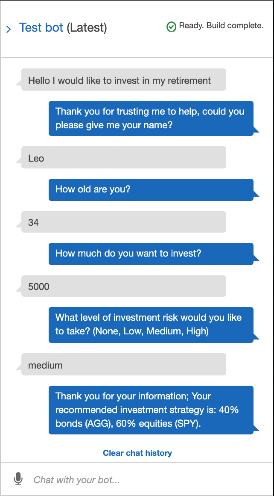

# Amazon Lex RoboAdvisor Powered by AWS Lambda

This repo contains two videos in the Videos/ directory.  The first one shows a basic Lex RoboAdvisor in action.  The second one shows a more advanced RoboAdvisor that uses an AWS Lambda function for initialization, validation, and fulfilment.

The AWS Lambda function code and the Test Events used to test the Lambda are also included in this repo (in the Lambda/ and Test_Events/ directories, respectively).

---

## Technologies

* AWS Lex
* AWS Lambda

---

## Example

---

## Contributors

Michael Danenberg

---

## License

MIT